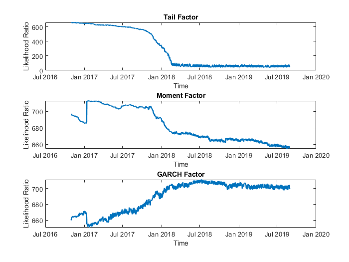

[](http://quantlet.de/)

## [](http://quantlet.de/) **CONV_cryptos** [](http://quantlet.de/)

```yaml

Name of QuantLet : CONV_cryptos

Published in : Genus_proximum_cryptos

Description : 'This quantlet proves the convergence of the cryptocurrencies over time, by computing Likelihood Ratio from binary logistic regression.'

Keywords : 
 - cryptocurrency
 - genus proximum
 - classiffication
 - multivariate analysis
 - convergence
 
Author : Daniel Traian Pele

See also : 'SFA_cryptos, FA_cryptos, DFA_cryptos'

Submitted : Fri, 21 April 2019 by Daniel Traian Pele

Datafiles : 'stats_dynamic.mat'


Example : 
- Please download and extract the 5 rar volumes in order to get the datafile
```

