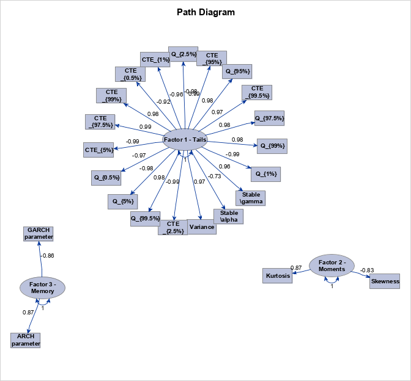

[](http://quantlet.de/)

## [](http://quantlet.de/) **FA_cryptos** [](http://quantlet.de/)

```yaml

Name of QuantLet : FA_cryptos

Published in : Genus_proximum_cryptos

Description : 'Performes Factor Analysis on a dataset of 23 variables, describing cryptos, 
stocks, FX and commodities.'

Keywords : 
 - cryptocurrency
 - genus proximum
 - classiffication
 - multivariate analysis
 - factor models
 
Author : Daniel Traian Pele

See also : 'SFA_cryptos, DFA_cryptos'

Submitted : Thu, 21 March 2019 by Daniel Traian Pele

Datafiles : 'dataset_crypto.xlsx'

Example : 
- Run the code and get the projection on 3 main factors

```

